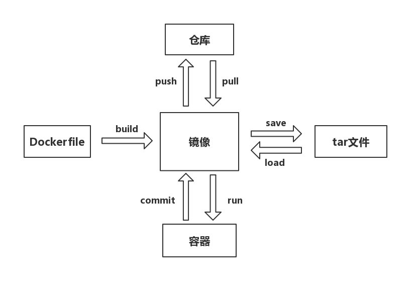

# Docker 快速上手指南

## 简介

Docker 是一个开源的应用容器引擎，让开发者可以打包他们的应用以及依赖包到一个可移植的容器中，然后部署到任何 Linux 机器上，也可以实现虚拟化．这里不对 Docker 进行深入的介绍，我们可以将其视作一个轻量级的虚拟机．

针对我们的应用场景（在无网络条件下进行算法模型的开发）来说，我们可以把开发算法所需要的各种依赖包全部安装到一个容器中，然后将此容器部署到服务器上，然后在该容器中开发和调试我们的算法．



上图以 Docker 镜像为中心，介绍了常用的 docker 命令及其关系．但是，由于我们使用的服务器无外网连接，我们的工作流程如下：

1. 本地编写 Dockerfile 文件，构建镜像．`docker build`
2. 导出镜像为 `tar.gz` 文件．`docker save <image name> | gzip > myimage.tar.gz`．镜像较小的可以不压缩，直接导出即可 `docker save -o myimage.tar`．
3. 将 `tar.gz` 文件上传到服务器．
4. 将 `tar.gz` 文件导入为服务器中的镜像．`docker load -i myimage.tar.gz`
5. 在服务器上从镜像创建并启动容器．`docker run`
6. 在容器中进行实验．

## 构建 Docker 镜像的环境

构建 Docker 镜像，我们首先需要一个可以运行 Docker 的环境．构建 Docker 镜像的机器不需要有显卡和显卡驱动．本地 Docker 的安装，请参考 Docker 的官方手册．
**注意：**我们需要检查 GPU 服务器上安装的 NVIDIA 驱动版本，`nvidia-smi` 输出的右上角显示 `CUDA Version: 12.3` 表示此版本的驱动最高可以支持到 cuda 12.3．

## Dockerfile

关于 Dockerfile 的编写，请参考[这个文档](https://yeasy.gitbook.io/docker_practice/image/dockerfile)，主要掌握 `FROM, COPY, CMD, ENV, ARG, WORKDIR` 这几个指令，其他指令可以暂时忽略．

### 基础镜像

我们建议使用一些可靠的上游镜像作为基础镜像来构建我们自己的镜像：

* [pytorch 官方镜像](https://hub.docker.com/r/pytorch/pytorch)：适合使用 pytorch 开发的用户，需要编译 CUDA 扩展的要用标签以 `devel` 结尾的版本，不需要的可以直接用 `runtime` 版本，镜像更小．
* NVIDIA 提供的 [pytorch 镜像](https://ngc.nvidia.com/catalog/containers/nvidia:pytorch)，这个镜像额外包含了 [NVIDIA apex](https://github.com/NVIDIA/apex) 和 [NVIDIA DALI](https://github.com/NVIDIA/DALI)
* [tensorflow 官方镜像](https://hub.docker.com/r/tensorflow/tensorflow/)：适合使用 tensorflow 开发的用户，注意选择标签中带 `gpu` 的版本才是支持 GPU 的．
* [NVIDIA cuda 官方镜像](https://hub.docker.com/r/nvidia/cuda)：不使用 pytorch 也不用 tensorflow，但是需要用到 CUDA 的用户可以选择此镜像．其中，标签带 `devel` 的版本提供完整的 CUDA，包括编译器 NVCC，适合需要编译 CUDA 代码的用户；不需要编译 CUDA 代码的用户可以使用 `runtime` 版本，镜像更小．进阶用户可以使用多阶段构建，即用 devel 镜像编译，然后把编译结果复制到 runtime 镜像，可大大减小镜像．
* [Minconda3 官方镜像](https://hub.docker.com/r/continuumio/miniconda3)：适合使用 python 但是不需要用 CUDA 的用户，同样适合 R 语言用户．此镜像只包含基础的 `conda` 命令，方便用户定制 conda 环境，不含 CUDA．
* [r-base 镜像](https://hub.docker.com/_/r-base)：Docker 官方提供的 R 语言镜像，供 R 语言用户使用．此镜像不含 CUDA．
* [NVIDIA NGC CUDA 镜像](https://catalog.ngc.nvidia.com/orgs/nvidia/containers/cuda)：此镜像有提供 cuda 10 等较老版本，而 Dockerhub 上的只有较新的版本．此外，NVIDIA NGC 还有其他可以使用的镜像可以考虑使用，但是需要注意，他们提供的镜像可能尺寸较大．
* [micromamba 镜像](https://hub.docker.com/r/mambaorg/micromamba)：这个是 miniconda 的一个替代，直接使用 micromamba 替代 conda 命令，在解决依赖的时候速度更快．

## Dockerfile 例子

请参考各个目录下的 `Dockerfile` 文件．

我们针对使用 VNC + XFCE 桌面的情况有一个比较简洁的例子，见 [stata-vnc](./stata-vnc)．

## 最佳实践

Docker 官方提供了一个 [最佳实践指南](https://docs.docker.com/develop/develop-images/dockerfile_best-practices/)，强烈推荐照做的有以下几点：

1. 使用合适的基础镜像，针对我们的具体情况，可以使用 pytorch, tensorflow, cuda, r-base 以及 miniconda3 镜像．
2. 构建镜像时始终指定名字和标签．
3. 不要直接在镜像中存入敏感信息，如密码等．
4. 不要直接把代码和数据塞到镜像里，而是通过运行容器的时候挂载源码和数据目录到镜像中去使用．
5. 理解构建上下文，详见[此文档](https://yeasy.gitbook.io/docker_practice/image/build#jing-xiang-gou-jian-shang-xia-wen-context)．
6. 尽可能减少层和镜像的大小．只有 `RUN, COPY, ADD` （不建议使用 `ADD`，使用 `COPY` 可以达到相同的效果）会创建层并且增加镜像的大小．有兴趣的用户可以了解多阶段构建，从而构建更小的镜像．
7. 尽可能的清除缓存，使得构建的镜像文件最小：
   1. 在使用 `apt-get` 命令的时候总是用 `apt-get update && apt-get install -y pkgname`．对于基于官方版本的 Debian 和 Ubuntu 镜像，Docker 默认会自动执行 `apt-get clean`，我们只需要加上 `rm -rf /var/lib/apt/lists/*` 命令即可．
   2. 使用 `yum` 命令（CentOS 7）安装的，最后要用 `rm -rf /var/cache/yum/*` 删除缓存．
   3. 使用 `dnf` 命令（CentOS 8）安装的，最后要用 `dnf clean all` 删除缓存．
   4. 使用 `pip install --no-cache-dir ` 来禁用 pip 的缓存．
   5. 如果使用了 `conda` 命令，则要使用 `conda clean -afy` 清除缓存．
   6. 高阶用户可以考虑使用实验性的 [Docker Buildkit 特性](https://github.com/moby/buildkit/blob/master/frontend/dockerfile/docs/syntax.md#run---mounttypecache)来自动清理缓存．
8. 建议对 Dockerfile 文件进行版本管理，以便随时能够从 Dockerfile 中构建出相同的环境．
9. **不要用 `docker commit` 来构建镜像，该命令会将当前容器与镜像之间的差异全部保存，生成镜像，通常难以维护，镜像文件也特别大，不方便使用．**

## 常用命令和选项

Docker 的命令很多，常用的主要有：

1. `docker image list` 查看镜像．
2. `docker ps` 查看容器，如果需要查看已经停止的容器需要用 `docker ps -a`．
3. `docker run` 从镜像创建容器，常用的选项如下：
   1. `--name NAME`：指定容器名称，强烈建议使用，以便区分．
   2. `-it`：使用交互式的 terminal，这个一般是必须的．
   3. `--gpus`：指定使用的 GPU，如 `--gpus 1` 使用第 1 块 GPU，使用多块 GPU 用逗号分隔，如 `--gpus 0,1`，使用全部 GPU 可以直接指定 `--gpus all`．
   4. `--shm-size`：指定 `/dev/shm` 的大小，如 `--shm-size 16G` 等．服务器上已经修改默认值为物理内存的一半，一般足够使用，但有需要的仍可以指定．
   5. `-v {宿主机路径}:{容器路径}`：挂载宿主机的某个目录到容器内的某个目录下，以便进行数据的读写等等．注意，这里的路径要写绝对路径．
   6. `-p {宿主机端口}:{容器端口}`：将容器中的端口映射到宿主机上．此时可以在宿主机上访问 `127.0.0.1:宿主机端口` 相当于访问到容器里对应容器端口的服务．注意，宿主机的防火墙需要开放宿主机端口才能从其他机器访问 `宿主机IP:宿主机端口`，否则需要使用 SSH 隧道访问，可以参考[这里](https://blog.mobatek.net/post/ssh-tunnels-and-port-forwarding/)设置 SSH 隧道．
   7. `--rm`：容器停止或者退出后自动删除该容器．
   8. 完整的例子：`docker run --gpus all -it -v /home/tom:/workdir/tom --shm-size 16G --rm --name mycontainer -v 9090:8080 pytorch/pytorch:1.6.0-cuda10.1-cudnn7-devel`．
4. `docker start` 启动一个已经停止的容器．
5. `docker stop` 停止正在运行的容器．
6. `docker attach` 连接到挂起的容器．
7. `docker exec -it {容器名/容器 ID} bash`  进入正在运行的容器．
8. `docker build` 从 `Dockerfile` 构建镜像，常用的选项：
   1. `-t`：指定标签名称．
   2. `--build-arg`：设定 `Dockerfile` 中的 `ARG` 的值，使用 `key=value` 的形式，多个 `ARG` 写成 `--build-arg key1=value1 --build-arg key2=value2` 的形式．
   3. `--no-cache`：不使用缓存的镜像．
   4. `--pull`：构建时拉取最新的镜像．
9. `docker save <image name> -o myimage.tar`  导出镜像，可以通过管道压缩一下，`docker save <image name> | gzip > myimage.tar.gz`．
10. `docker load -i myimagefile` 导入镜像．

## 注意事项

1. 请指定容器的名称，以用户名为前缀，例如：

   ```bash
   # 使用 GPU 的用户
   docker run --gpus all -it -v /home/tom:/workdir/tom --shm-size 32G --rm --name tom-bert myimageid
   # 不使用 GPU 的用户
   docker run -it -v /home/tom:/workdir/tom --shm-size 48G --rm --name tom-r-env myimageid
   ```

2. Docker 容器内创建的文件都是 root 用户的，在容器外的时候无法进行修改．此时可以在容器内使用 `chown` 命令修改．

   1. 首先在**容器外（即宿主机）**使用命令 `id testuser` 查看用户 `testuser`的 uid（用户 ID）和 gid（组 ID）．

   2. 然后在**容器内**使用命令 `chown uid:gid -R dir` 将 `dir` 及其所有子目录下的文件目录都修改．这样在容器外的用户 `testuser` 即拥有相应的读写权限了．

   3. 还可以在启动容器的时候就以自己的用户启动，即

      ```bash
      docker run -it -v /home/tom:/workdir/tom --shm-size 48G --rm --name tom-r-env --user $(id -u):$(id -g) myimageid
      ```

3. 在容器内使用了 `exit, quit` 等命令退出容器导致容器停止运行．可以使用 `Ctrl+P+Q` 将容器挂起到后台，需要重新连接时可以用 `docker attach` 或者用 `docker exec -it {容器ID} bash` 开新的交互式终端使用．

4. 在构建需要用 NVCC 编译安装一些扩展包的镜像时，注意指定环境变量 `FORCE_CUDA=1` 和 `TORCH_CUDA_ARCH_LIST="6.1;7.0"`．这两个环境变量是针对 pytorch 的，tensorflow 用户请查阅相关文档．`TORCH_CUDA_ARCH_LIST` 的值为显卡的计算能力（Compute Capability），具体显卡型号对应的取值请参考[此官方文档](https://developer.nvidia.com/cuda-gpus)和[此文档](https://arnon.dk/matching-sm-architectures-arch-and-gencode-for-various-nvidia-cards/)．常用的几款显卡的 Compute Capability 和支持的 CUDA 版本如下表所示：

   | 显卡                | Compute Capability | CUDA 版本 |
   | ------------------- | ------------------ | --------- |
   | Quadro P4000        | 6.1                | >= 8      |
   | NVIDIA TITAN Xp     | 6.1                | >= 8      |
   | Tesla V100          | 7.0                | >= 9      |
   | Geforce RTX 2060    | 7.5                | >= 10     |
   | Geforce RTX 2080 Ti | 7.5                | >= 10     |
   | NVIDIA A100         | 8.0                | >= 11     |


## 参考

Docker 十分钟入门：https://www.bilibili.com/video/BV1R4411F7t9

Dockerfile 详解：https://www.bilibili.com/video/BV1k7411B7QL

Docker 从入门到实践：https://yeasy.gitbook.io/docker_practice